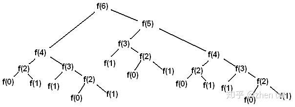

# 动态规划特点 

动态规划求解问题的四个特点:
1. 求一个问题的最优解.
2. 整体问题的最优解依赖于各个子问题的最优解.
3. 我们把大问题分解成若干个子问题,这些小问题之间还有相互重叠的更小的子问题.
4. 用从上往下的顺序先计算小问题的最优解,并存储下来,再以此为基础求取大问题的最优解.

# 斐波那契数列  
> 数列：0,1,1,2,3,5,8,13,21,34,55,89,144,233    
> 状态转移方程：f(n) = f(n-1) + f(n-2)  
> 问题：第n个值为多少？



### 简单递归

```python
def fib(n):
    if n<2:
        return n
    else:
        return fib(n-1) + fib(n-2)

if __name__ == '__main__':
    result = fib(100)
```

优点：简单易懂
缺点：
1. 栈空间浪费，甚至栈溢出
2. 时间复杂度O(2^n), 


### 动态规划

```python
def fib(n):
    results = list(range(n+1))
    for i in range(n+1):
        if n<2:
            results[i] = i
        else:
            results[i] = results[i-1] + results[i-2]
    return results[-1]
if __name__ == '__main__':
    result = fib(100)
```
本例有点空间换时间的意思


# 如何理解动态规划？  
[牛岱的回答 - 知乎](https://www.zhihu.com/question/39948290/answer/612439961)  
[zhen tan的回答 - 知乎](https://www.zhihu.com/question/39948290/answer/883302989)

# 练习题

剑指offer面试题14：剪绳子

题目：给你一根长度位n的绳子，请把绳子减成m段（m，n都是整数，n>1并且m>1），每段绳子的长度记为k[0],k[1],k[2],....k[m]。请问k[0] *k[1]*k[2]....*k[m]可能的最大乘积是多少？例如：当绳子的长度是8时，我们把它减成长度分别为2，3，3三段，此时得到的最大乘积是18.


<details>
  <summary>提示1</summary>
动态算法:（由上到下分析，由下到上编码)   

设求绳子截取成若干段后绳子的乘积最大值是f(n),当我们截取长度是i的>绳子时 ,有多种可能1,2,3,4,5......n-1；因为对应的f(i)*f(n-i)>也不同，我们f(n)求得得事最大值，因此f(n) = Max(f(i) *f(n-i));
</details>


<details>
  <summary>提示2</summary>
4 ： 2*2
5 ： 2*3
6 ： 3*3
7 ： 2*2*3 或者4*3
8 ： 2*3*3
9 ： 3*3*3
10：2*2*3*3 或者4*3*3
11：2*3*3*3
12：3*3*3*3
13：2*2*3*3*3 或者4*3*3*3
</details>

[答案](https://blog.csdn.net/qq_40931405/article/details/83097357)


